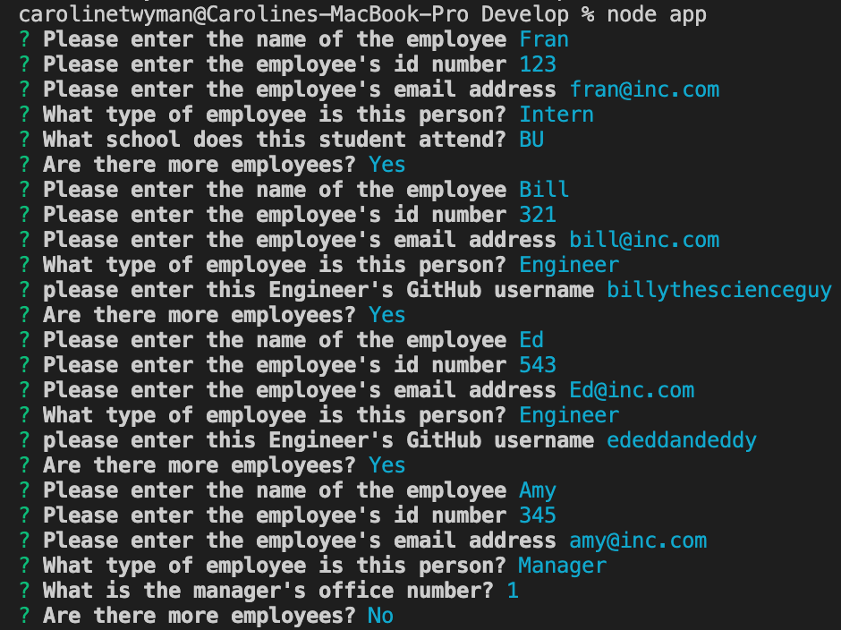

  
# Employee Management System

## Table of Contents
* [Description](#description)
* [Installation](#installation)
* [Usage](#usage)
* [License](#license)
* [Contributors](#contributors)
* [Questions](#questions)

## Description
This Project is a dynamic CLI app designed to create employee profiles for an organization. 

## Installation Instructions
To install the app, you must clone the repository to your local device.

## Usage Information

For a walkthrough please visit [my YouTube](https://www.youtube.com/watch?v=eGrjobAvOo8&feature=youtu.be&ab_channel=Caroline)

To use the app, enter the Develop Directory and type the command "node app" or "node app.js." 

To run tests, from the same location, type the command "npm test."

## License
ISC

## Contributors
Caroline Twyman

## Questions
Contact me:

Github: [https://github.com/carolinetwyman](https://github.com/carolinetwyman)
Email: [carolinetwyman@gmail.com](carolinetwyman@gmail.com)

For more of my projects, please see my [portfolio](https://carolinetwyman.github.io/PortfolioCaroline/portfolio.html)
